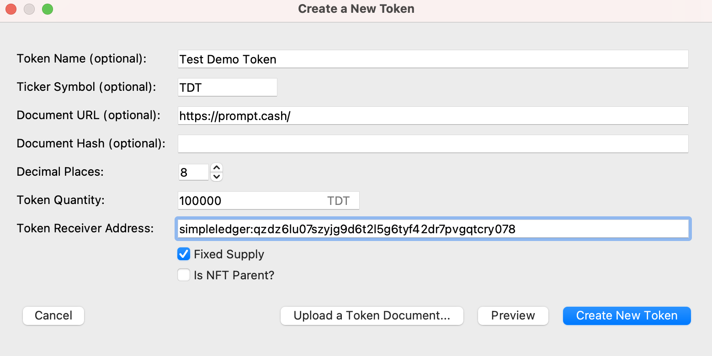

# Promt.cash SLP tokens
You can add your own [SLP token](https://simpleledger.cash/) to our processor to receive payments
in your token.

Prompt.Cash will take care of exchange rate updates automatically for you.
For example `&amount=10&currency=EUR&slp_token=USDT` would request a payment of EUR 10
using Tether (on BitcoinCash) taking into account:
- the current EUR/USD exchange rate
- the current USD/USDT exchange rate

## Token integration
Your token needs to be approved manually. This process only takes a few
minutes and is mainly done to prevent scams (you can not submit a token
called `USDT` or any other existing symbol).

Steps to integrate your own SLP token:

1. Contact us to whitelist/approve your SLP token. Please submit:
    - **SLP token ID**: you can find it on the [SLP token explorer](https://simpleledger.info/)
    - **Project Website** & contact address (Telegram or email)
    - **Token Icon**: a square 128×128 sized PNG icon for your token  
    - **USD exchange rate** for your token (can be fixed or an API of an exchange)
2. After approval, open the [Accounts Page](https://prompt.cash/account) and enable the checkbox **Enable SLP Tokens**.
   You must ***connect a wallet that supports SLP tokens*** (such as [Electron Cash SLP Edition](https://github.com/simpleledger/Electron-Cash-SLP)), or else
   your received tokens may get lost when you move your funds.
3. Enable your token on the [SLP Tokens Page](https://prompt.cash/slp-tokens). 
4. Open the [Integration Page](https://prompt.cash/integration)
    at your Prompt.Cash account (you must be logged in). Copy the **Payment Link**.
5. Add the parameter `&slp_token=SPICE`to the URL. Use your own token code (instead of `SPICE`) .
    Example: `https://prompt.cash/pay?token=1-j8YacvJo&tx_id=merittest-2&amount=0.01&currency=USD&slp_token=SPICE&desc=Token-Example`
6. Track your payment status via (identical to tracking `BCH` payments):
    - our [REST API](https://prompt.cash/pub/docs/#get-a-single-payment) or
    - the `&callback=` parameter which will notify your server once a payment has been received.
    
## Parameter Overview

All parameters of the above payment link are identical to our [REST API](https://prompt.cash/pub/docs/).
Please refer there for further details.

The REST API also allows you to generate secure payment links per customer
on your own backend (links that can't be spoofed).

## Token creation

To create your own SLP token on BitcoinCash you can:
1. Open the [Electron Cash SLP Edition](https://github.com/simpleledger/Electron-Cash-SLP) wallet.
2. Navigate to the **Tokens** tab.
3. Click on **Create New Token** at the bottom.
4. Fill out all the fields in the new window.
5. Click on **Create New Token**.

## Contact
[Website](https://prompt.cash/) —
[Twitter](https://twitter.com/CashPrompt) —
[Telegram](https://t.me/PromptCash) —
[YouTube](https://www.youtube.com/channel/UClfNVdL3T0RF6pF1yGi9teg)
